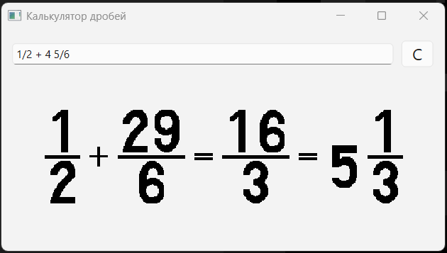

# Fraction Calculator (PyQt6)

Графический калькулятор для работы с обыкновенными и смешанными дробями.

## Особенности
- Поддержка сложения, вычитания, умножения и деления дробей.
- Ввод дробей в формате `a/b` или смешанных чисел `c a/b`.
- Результат отображается как дробь и как смешанное число.
- Графический интерфейс с цифрами в виде картинок.

## Установка
1. Клонируйте репозиторий:

git clone https://github.com/DmitryDorzhievich/FractionCalculator.git

2. Перейдите в папку проекта:

cd FractionCalculator

3. Установите зависимости:

pip install -r requirements.txt

## Запуск

Запустите калькулятор:

python main.py

## Сборка в .exe (опционально)

Если хотите собрать исполняемый файл для Windows:

pyinstaller --onefile --windowed --add-data "images;images" main.py

После сборки .exe будет в папке dist/.

Папка images/ будет встроена в exe, поэтому картинки цифр будут отображаться корректно.

